# Social Dining App API
Social Dining App Server serving up the RESTful API to the Social Dining App Client. The API follows REST best practices with the endpoints below utilized within the Front End Client. 

## API Documentation

* **Endpoints**
  * **/api/users**
    * GET
    * POST
    * PATCH
    * DELETE
    * _/:user_id
      * GET
    * **/all/events**
      * GET
  * **/api/events**
    * GET
    * POST
    * **/:event_id**
      * GET
      * PATCH
      * DELETE
  * **/api/attendees**
    * GET
    * POST
    * DELETE

## Built with
* NodeJS
* ExpressJS
* PostgreSQL

## Demo

- [Client Repo](https://github.com/djbradleyii/social-dining-app-client)
- [Live Demo](https://social-dining-app.now.sh/)

## Screenshots
Landing Page:

Register:  
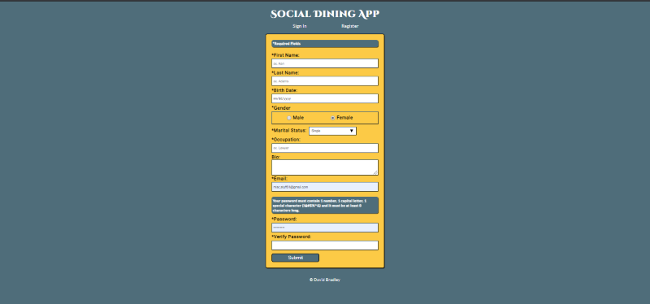

Error:  
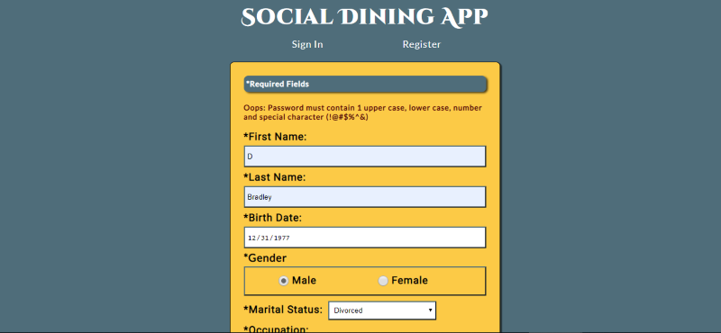

Account Created:  
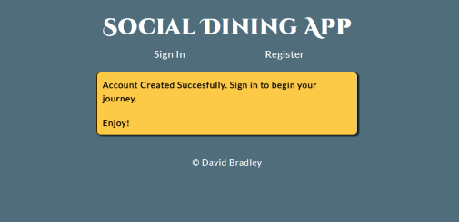

Sign In:  
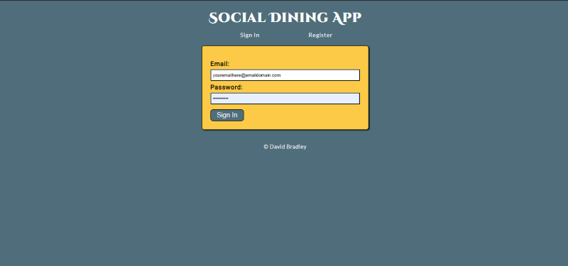

Dashboard:
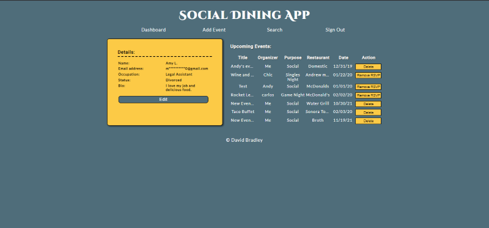

Edit User Details:
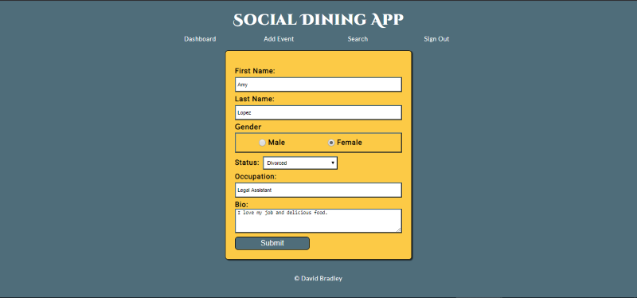

Edit Event Details:
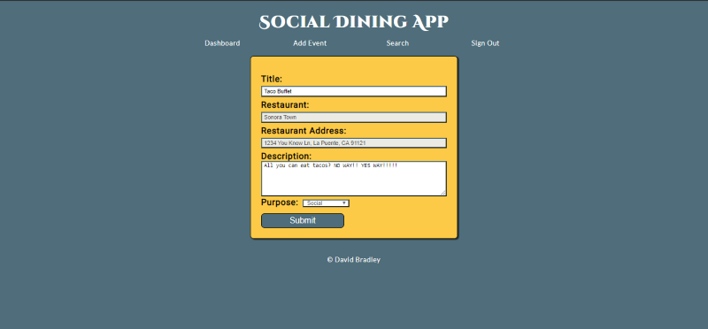

Add Event:
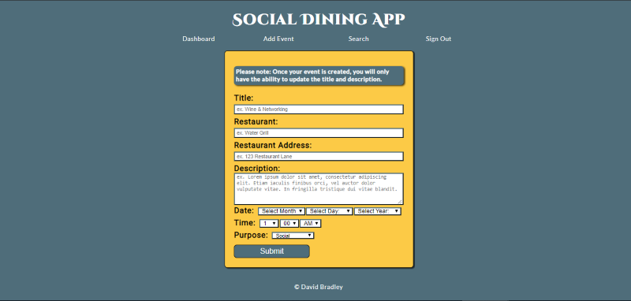

Search:  
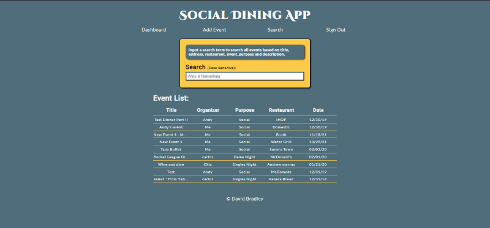

Event Details:
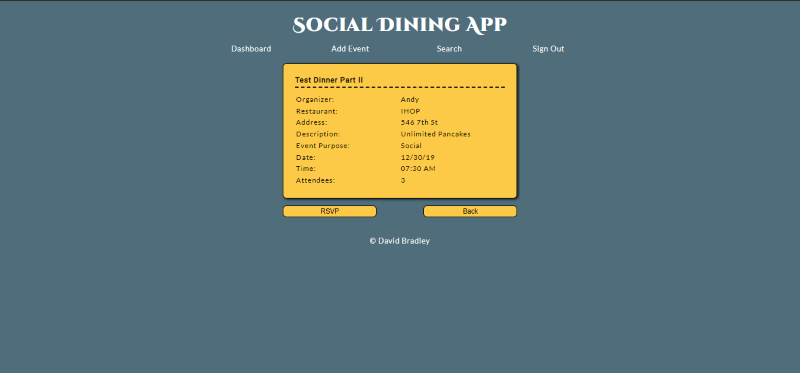

Event Organizer Details:
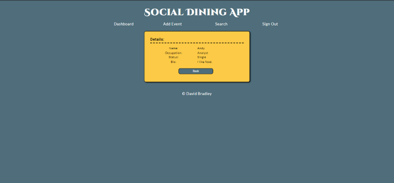

Logged Out:  

